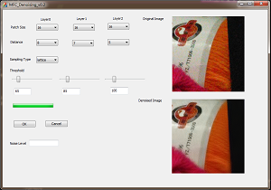
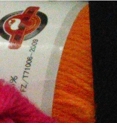
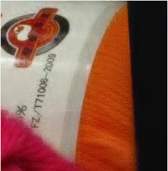

# image_denoising
fast effective denoising. This work is based on RRDCT, two major improvements are provides. 1. multi-scale fusion using Laplacian pyramid to keep more details of an image. 2. image noise estimation automatically. 
# description
This project provides an Image Denoising Algorithm using Randomized Redundant Discrete Cosine Transform. And the performance of the algorithm is improved by using image pyramid, i.e, image denoising from multi-sacle. We also provide a method using PCA to estimate the image noise level by analying the eigenvalue of the convariance matrix. 
The code is tested on OpenCV 3.0 or later and Visual Studio 2012. We built a MFC project for convinence interaction. And the interface of the software is shown as following:

# reference
[1] Yu G, Sapiro G. DCT image denoising: a simple and effective image denoising algorithm[J]. Image Processing on Line, 2011, 1.
[2] Fujita S, Fukushima N, Kimura M, et al. Randomized redundant DCT: efficient denoising by using random subsampling of DCT patches[C]// SIGGRAPH Asia 2015 Technical Briefs. ACM, 2015.
[3] Guangyong Chen, Fengyuan Zhu, Pheng Ann Heng, An Efficient Statistical Method for Image Noise Level Estimation, ICCV, 2015, 2015 IEEE International Conference on Computer Vision (ICCV), 2015 IEEE International Conference on Computer Vision (ICCV) 2015, pp. 477-485, doi:10.1109/ICCV.2015.62
# results
we show some image patch here of the noise image and denoised image. From the result, we can see this algorithm has a good performance.

